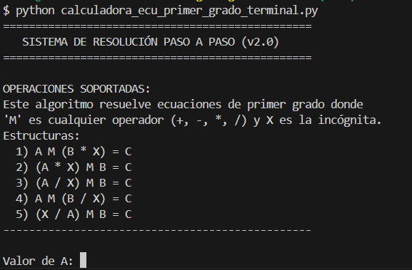
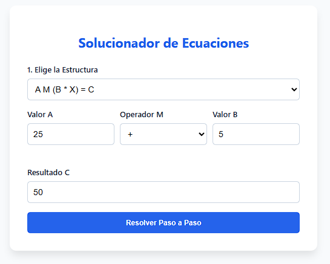

# 🧮 Solucionador de Ecuaciones de Primer Grado - Ingeniería del Conocimiento

Este proyecto implementa un motor de resolución algebraica basado en estructuras de nodos y transposición de términos. El objetivo es resolver ecuaciones de primer grado con diversas morfologías, permitiendo que el usuario defina la posición de la incógnita () y los operadores aritméticos ().

## 🚀 Características

* **Lógica Multiestructura**: Soporta 5 configuraciones distintas de ecuaciones basadas en la posición de  y .
* **Operador Dinámico ()**: Capacidad de procesar suma, resta, multiplicación y división como operadores principales.
* **Resolución Paso a Paso**: Explica la lógica de despeje (transposición) en lenguaje humano.
* **Dualidad de Interfaz**: Incluye una versión robusta para terminal (Python) y una interfaz gráfica interactiva (HTML/JS).


## 🛠️ Estructuras Soportadas

El sistema identifica y resuelve las siguientes formas algebraicas (donde ):

| ID | Estructura | Lógica de Despeje |
| --- | --- | --- |
| **1** | $A \ M \ (B \cdot X) = C$ | Transposición de  y división por  |
| **2** | $(A \cdot X) \ M \ B = C$ | Transposición de  y división por  |
| **3** | $(A / X) \ M \ B = C$ | Transposición de  e inversión de  |
| **4** | $A \ M \ (B / X) = C$ | Transposición de  e inversión de  |
| **5** | $(X / A) \ M \ B = C$ | Transposición de  y multiplicación por  |

---

## 💻 Componentes del Proyecto

### 1. Script de Terminal (`calculadora_ecu_primer_grado_terminal.py`)

Algoritmo puro en Python sin librerías externas. Ideal para pruebas rápidas y entornos de servidor.

* **Uso:** `python calculadora_ecu_primer_grado_terminal.py`
* **Salida:** Traza completa en consola con el valor final de .

### 2. Interfaz Web (`calculadora_ecu_primer_grado_grafico.html`)

Implementación con **HTML5, CSS3 y JavaScript vanilla**.

* **Visualización:** Renderiza los pasos de forma amigable.
* **Interactividad:** Menús desplegables para cambiar la morfología de la ecuación en tiempo real.

---

## 📖 Cómo usar los Scripts

### 1. Script de Terminal (Python)

Este script es ideal para entornos de desarrollo y pruebas rápidas de lógica.

**Requisitos:** Tener instalado Python 3.x.

**Pasos para ejecutar:**

1. Abre tu terminal o consola (PowerShell, Bash, MINGW64, etc.).
2. Navega hasta la carpeta del proyecto: `cd c:/codigo/IngConocimiento`
3. Ejecuta el comando:
```bash
python calculadora_ecu_primer_grado_terminal.py

```


4. Sigue las instrucciones en pantalla: ingresa los valores de **A, B, C**, elige el **operador** y selecciona la **estructura** deseada.

### 2. Interfaz Web (HTML/JS)

Una calculadora visual interactiva que no requiere instalación de lenguajes de programación para el usuario final.

**Pasos para ejecutar:**

1. Localiza el archivo `calculadora_ecu_primer_grado_grafico.html` en tu explorador de archivos.
2. Haz doble clic sobre él o arrástralo a tu navegador (Chrome, Edge, Firefox).
3. Selecciona la estructura en el menú desplegable, rellena los campos y presiona el botón **"Resolver Paso a Paso"**.

---

## 🧠 Lógica del Algoritmo (Pseudo-código)

El núcleo del software utiliza una función de "reversión" para el operador :

```python
Definir Deshacer_M(Valor_A, Resultado_C, Operador):
    Si Operador es '+': Retornar Resultado_C - Valor_A
    Si Operador es '-': Retornar Valor_A - Resultado_C
    Si Operador es '*': Retornar Resultado_C / Valor_A
    Si Operador es '/': Retornar Valor_A / Resultado_C

```
### Ejemplos practicos

Ejemplo 1:


Ejemplo 2:


Manejo de errores:


---

## 📂 Capturas de Pantalla del Software

### Interfaz de Terminal



### Interfaz Web



---

**Desarrollado como parte del módulo de Ingeniería del Conocimiento.** *Basado en el modelo de nodos y transposición aritmética.*